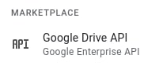

## google_drive
Scripts for upload files to your Google Drive.

### How to get token ([official guide](https://developers.google.com/drive/api/quickstart/python))
1. Open [Google Console](https://console.cloud.google.com)
2. Create new project for work with Google Drive: **Select a Project** -> **New Project**
3. Select project
4. Find in search **Google Drive API**  

5. Enable
6. In the Google Cloud console, go to the Credentials page ([Go to Credentials](https://console.cloud.google.com/apis/credentials))  
7. Click **Create Credentials** -> **OAuth client ID**  
If you don't see warning: "**To create an OAuth client ID, you must first configure your consent screen**" go to 20 step:
8. Click **Configure Consent Screen**
9. **User Type** -> **External**
10. Click **Create**
11. **App name** - set your application name
12. **User support email** - your email
13. **Developer contact information** - any email
14. Click **Save and Continue**
15. Click **Save and Continue**
16. **Test users** -> **Add Users** -> your email
17. Click **Save and Continue**
18. Go to Credentials
19. Click **Create Credentials** -> **OAuth client ID**  
20. Click **Application type** -> **Desktop app**
21. In the **Name** field, type a name for the credential. This name is only shown in the Google Cloud console
22. Click **Create**. The OAuth client created screen appears, showing your new Client ID and Client secret
23. Click OK. The newly created credential appears under OAuth 2.0 Client IDs.
24. Save the downloaded JSON file as credentials.json, and move the file to your working directory.
25. Run `python3 get_token.py`
